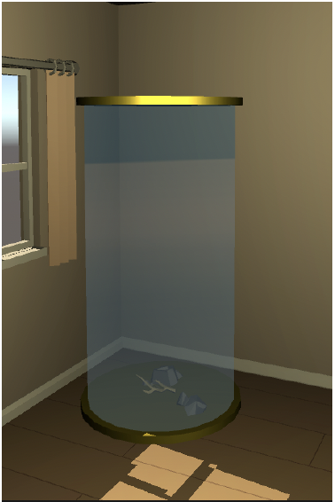
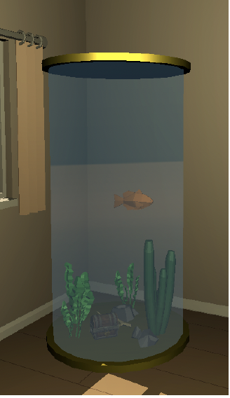
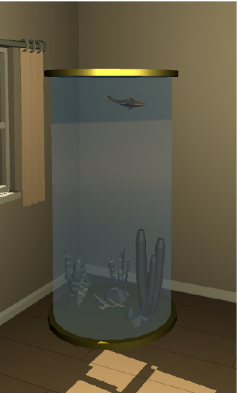
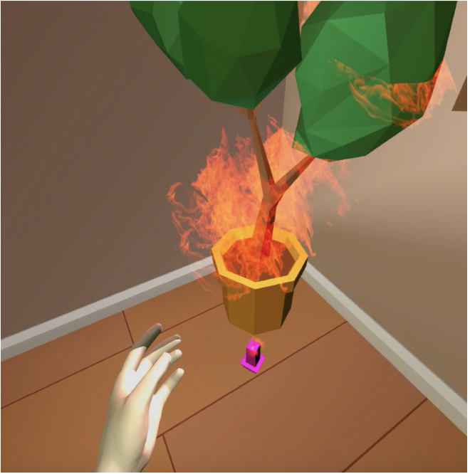
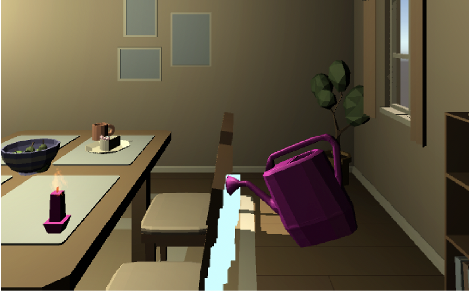

## Overview
I developed the Aquarium of Morality for a Virtual Reality class. Watch as your actions –good or bad– alter your magical aquarium. Positive actions will cause it to flourish while negative ones cause it to decay.

## Description
Users are placed in a setting they can explore and interact with. Actions they perform are evaluated as good or bad and kept track of with a point system. The manifestation of these actions take effect on an aquarium. To keep it alive and grow it further, users must perform typically constructive actions. The more positive actions, the more the aquarium will develop –and vice versa for destructive actions.

### Aquarium
Neutral             |  Good         |  Bad  
:---------------:|:-----------------:|:-----------:
 |   | 

## Software and Tools 
* Unity 3D
* Oculus Quest

## How to use the Oculus Quest with this game
#### Navigation
Walk normally within the pre-set bounds or move using the left analog stick on the Oculus Quest 2 controllers
#### Camera
Look around normally or use the right analog stick on the controllers to shift camera view
#### Interaction
* Purple objects are tools that can be interacted with
* Current implemented interactions:
    * Set fire to the plants with the candle
    * Water the plants with the watering can

Set fire to the plants with the candle |  Water the plants with the watering can           
:-----------------------------:|:--------------------------:
 |   

