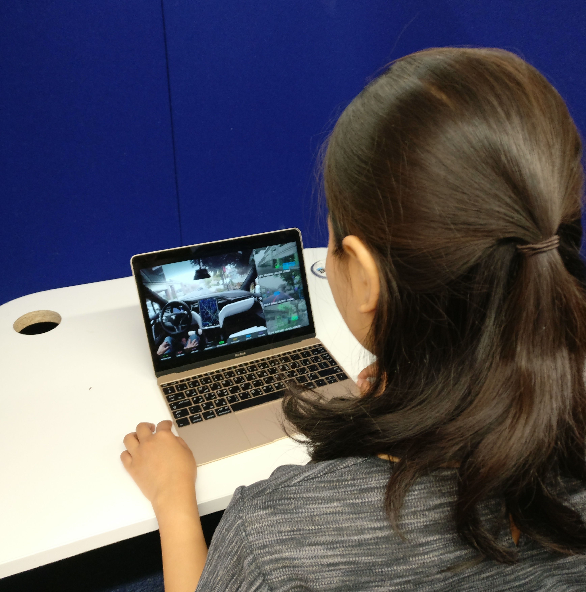

## Overview
For my MSc dissertation at [University College London's Interaction Centre](https://uclic.ucl.ac.uk) (UCLIC), I performed qualitative research in the field of autonomous vehicles (AVs) under the supervision of [Duncan Brumby](https://scholar.google.com/citations?user=C5eTGe8AAAAJ&hl=en&oi=ao). My focus was on how people feel and behave towards relinquishing control of navigation. That is, when the navigation process is automated.

## UX Concepts
* Thematic analysis
* Contenxtual inquiry
* Semi-structured interviews
* Design fictions

## Description
To simulate various of levels of automation, I chose two modes of transportation in London: Uber and black cabs. In both cases, passengers hand over control to some other entity (the driver) to get to some location. With Uber, there is also the element of automating navigation via technology; the directions are provided in real-time by digital maps. 

I recruited three participants for a 2x2 within-subjects study where the independent variables were 1) the transport service (Uber or [London black cab](https://tfl.gov.uk/info-for/taxis-and-private-hire/licensing/learn-the-knowledge-of-london)) and 2) familiarity of destination (familiar or unfamiliar). 

I interviewed the participants before and after their journeys; first to understand their preferences and perceived habits, and second to reflect on their behaviors during the rides.

The last part of the study consisted of a "design fiction"; I presented participants with videos of current semi-autonomous vehicles from the point of the view of the driver and asked them to imagine they were they "drivers".

## Findings
I identified some reocurring themes from observations and interviews. To summarize, firstly, participants expressed high levels of trust in both the Uber and taxi cases, while expressing confidence in taxi driver's knowledge of the roads. Participants' reflections also suggest that trust in Uber was achieved due to transparency of information relayed to the user, such as the route and driver's information.

Participants were more inclined to get lost in their smartphones for most of the journeys, and only paid attention to their surroundings with sudden braking or when taking an unfamiliar route or with sudden braking. With the latter case, participants kept an eye out for familiar landmarks or "anchors".

The main takeaways for automating navigation in an autonomous vehicle are the need for stimulation and transparency. These factors emerged from observing prevalent behaviors, including frequency of seeking distractions and the implications of trust being closely tied to how much information is known about the car ride.

<!--  -->

