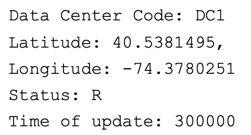
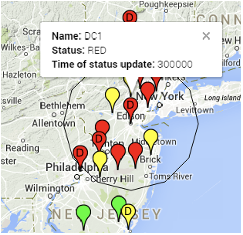

#### Overview
I created StormFinder during my internship at Bell Labs Dublin under the supervision of [Alessandra Sala](https://scholar.google.com/citations?user=_s17ezAAAAAJ&hl=en). The goal of this project was to provide a proactive solution to avoid the loss of data at telecom data centers caused by storms. With the help of this tool, network traffic can be rerouted before a storm occurs. 

StormFinder informs users of whether a data center is in danger of being hit by a storm with varying levels of 'danger' categories. It does so by collecting weather reports from METAR data (Meteorological Terminal Aviation Routine Weather Report). METARs are standardized weather reports often provided by airports and weather observation stations. Given the coordinates of a specific data center that one would like to monitor, several METARs can be collected in the surrounding area. By specifying the radius of interest (in kilometers), StormFinder parses the relevant METARs and then does the following:
1. Classifies the relevant stations (or airports) as `RED`, `YELLOW`, or `GREEN` in decreasing levels of severity depending on predefined threshold values.
2. Classifies the data center into one the same categories based on the number of `RED` and `YELLOW` stations nearby. 

StormFinder provides both a text-based output for the status of the data center as well as a more user-friendly display in the form of a Google Maps embedded HTML page with color-coding.

**Sample Output**
  |  
<!-- 

    

        
    

    

        
    

 -->

#### Software and Tools 
* Python 2.7 with Google Maps Javascript API
* Python packages: 
    * `metar`: python package for interpreting METAR and SPECI weather reports
    * `pygmaps`: python package for plotting data on Google Maps, generates Javascript and HTML
    * `geo`: python module created by Maximilian Högner that does simple vector calculations with geographic coordinates

